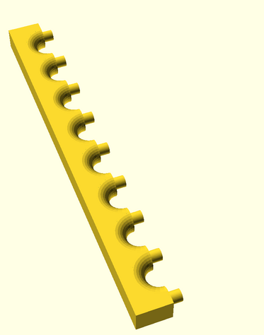
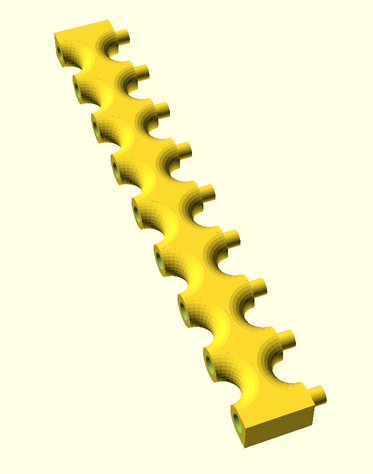
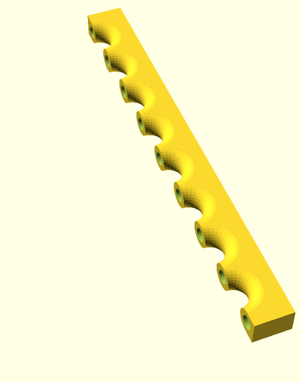
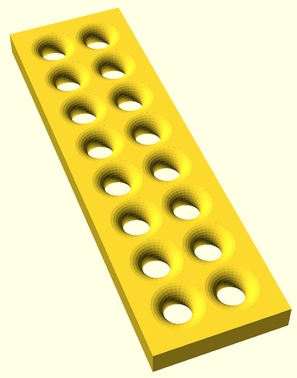
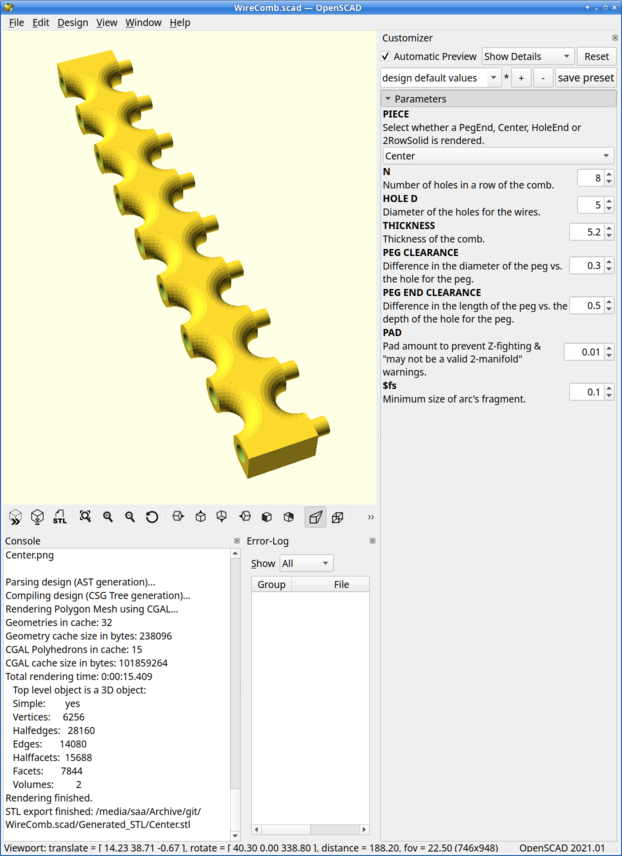

# WireComb.scad
This is the OpenSCAD source for a parameterized cable wire comb that is
used to maintain the arrangement of wires within a cable harness or of
cables within a bundle.

The comb is made up of bars that when fitted together make rows of radiused
holes to run wires through.  The bars fit together using pegs facing one
way and holes to receive the pegs facing the other way.

Four different pieces can be rendered from this file:

| Peg End | Center | HoleEnd | 2RowSolid |
| --- | --- | --- | --- |
|  |  |  |  |

Depending on how many rows you want in your comb, zero or more "Center" pieces
may be fitted between a "HoleEnd" and a "PegEnd".

I rendered "2RowSolid" for illustrative purposes, but it could be printed and/or
modified if needed.

The number of holes in a row, the diameter of the holes, the thickness of
the comb and other parameters can be modified by editing the
[source](WireComb.scad) or using OpenSCAD's Customizer as seen on the right
side of this screenshot:

I print "PegEnd" and "HoleEnd" pieces with the flat, rectangular side down.  I
print "Center" pieces with the holes down and pegs up.  On my low-end printer,
this causes ridges to be formed on the edges of the holes which I remove by
pushing the shank of an appropriately sized drill bit into the hole.  For all
pieces I print a brim on the base plate to minimize warpage and to consolidate
the first layer of a "Center" piece.
